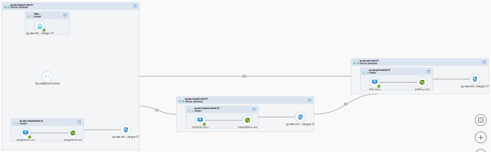
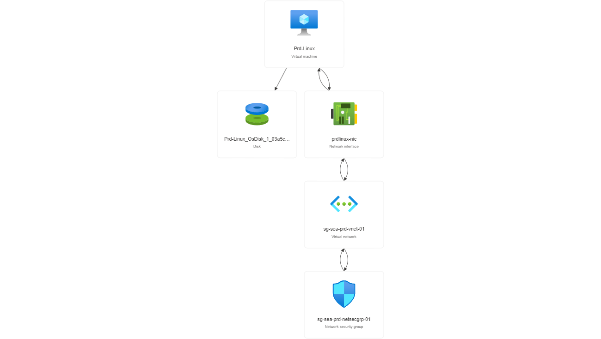
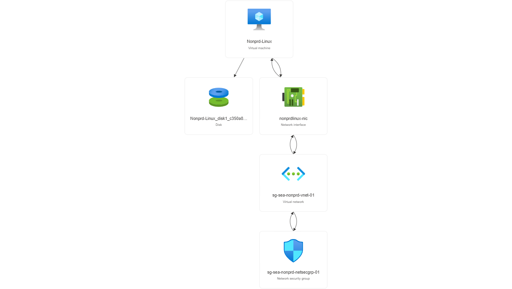

# Using module
## Modules Overview
Terraform modules help in abstracting and simplifying the management of infrastructure as code, promoting code reuse, and enabling collaboration among teams working on similar infrastructure patterns. For more information, you can click [here](https://developer.hashicorp.com/terraform/tutorials/modules/module) \
Using modules in Terraform offers several benefits:
- **Code reusability:** Modules allow you to write infrastructure *code once and reuse it across multiple projects or environments*, promoting consistency and reducing duplication
- **Abstraction:** Modules provide an abstraction layer that *hides complex configurations* and exposes a simplified interface. This makes it easier for users to consume the module without needing to understand its internals.
- **Organization:** Modules enable you to *organize your infrastructure code into logical units*, making it easier to manage and maintain complex infrastructure configurations.
- **Collaboration:** Modules can be *shared and reused by teams and individuals*, promoting collaboration and knowledge sharing.

## Variable Files
- **Static Local Variables** (locals.tf): A local value assigns a name to an expression, so you can use the name multiple times *within a module instead of repeating the expression*. More information, click [here](https://developer.hashicorp.com/terraform/language/values/locals)
- **Dynamic Local Variables** (variables.tf): To use variables from a variables file, you can either *pass it directly as a command-line* argument when running Terraform commands or by *using a Terraform configuration file* (e.g., main.tf) that references the variables file. More information, click [here](https://developer.hashicorp.com/terraform/language/values/variables)

## Module Architecture

In this method, the project will be organized into 4 modules: general, dmgmt, nonproduction and production folder
- **general** folder: The code will create some common resources such as Key Vaults (keyvault.tf), DDoS Protection (ddosprotection.tf), Moniter (governance.tf) and Connection between the virtual networks (peering.tf)

- **dmgmt** folder: Create all resources in management group.

- **production** folder: Create all resources in production group

- **nonproduction** folder: Create all resources in non-production group

## Module Breakdown:
It’s common to define providers, input variables, and output values in their files. Execute the following:
- provider.tf will be executed first in *terraform init* to pull .terraform file including modules and providers information. This file will execute **around 30s**
- All variables in locals.tf and variables.tf files will be loaded into memory **in seconds**
- Modules will be called in main.tf file. All modules will complete after **30-40 minutes** depending on Azure's current workloads. The longest execution is to create Azure Gateway (the record time is ~60 mins)
  - *general* module will create some Fundamental Resources
  - *dmgmt, production and nonproduction* modules will be executed after general module completes. In each module, a virtual machine will be created for **testing purpose**
- output.tf will show some necessary informations relating to resources created

=> The Landing Zone created by Terraform will complete in around 45 mins

## How to use this method:
- Step 1: Check **locals.tf** file and edit some essential variables to adapt for your demain
- Step 2: Run **teeaform init** to pull the corresponding provider folder (*.terraform* folder)
- Step 3: Run **terraform validate** to check whether the current configuration is valid
- Step 4: Run **terraform plan -out main.tf** to create an executive plan (*main.tf* file), check the azure account, azure subscription to see the current state
- Step 5: Run **terraform apply** to create or update infrastructure. The state of the terraform deployment (ip, address, ...) will be writen into *terraform.tfstate* and *terraform.tfstate.backup* will be created automatically for backup purpose. 
- Step 6: Run **terraform destroy** to delete all resource created

## Note: 
- We can *ignore the provider* registration by *skip_provider_registration = "true"* in **provider.tf** file. You can replace this command to your tenant_id, subscription_id, client info, ...
- Microsoft will offer **free $200** in the first month when you create a new Azure account. A trial account will facilitate its owner a change to experience a wide range of Azure's services. However, Azure will **limit the Usage of resources**, user can check the account limit in Search Bar by typing Quotas
- All essential variables will be declared in **locals.tf** file such as: localtion, resource groups, address spaces, subnets,... You can edit all variables to adapt your requirements
- If you want to create *Gateway* and *Bastion*, you have to create **GatewaySubnet** and **AzureBastionSubnet** for specific services respectively
- The **Storage account** will be *retain 14 days* after delete by Azure policy. Therefore, you have to change Storage Account Name in *locals.tf file* at *name_of_stracc* variable to prevent the error
- **Resource Templates** were exported and saved in Azure/resource name

## Azure diagram

## Azure resouce visualizer
- sg-sea-dmgmt-rsg-01

- sg-sea-prd-rsg-01

- sg-sea-nonprd-rsg-01
