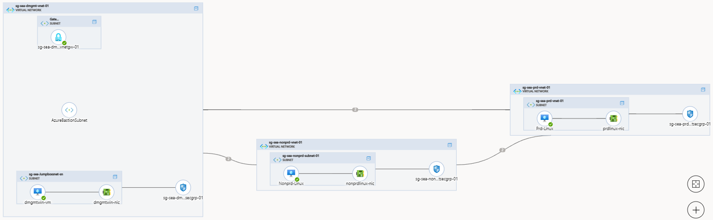
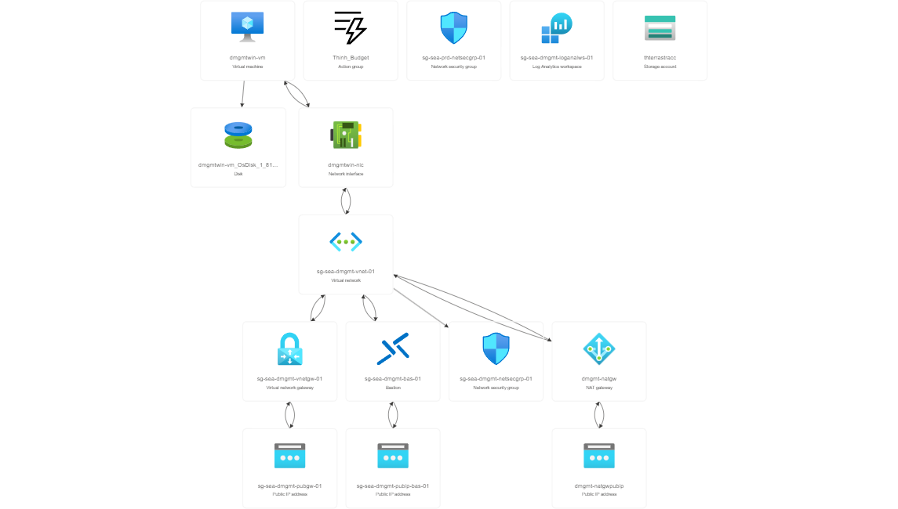
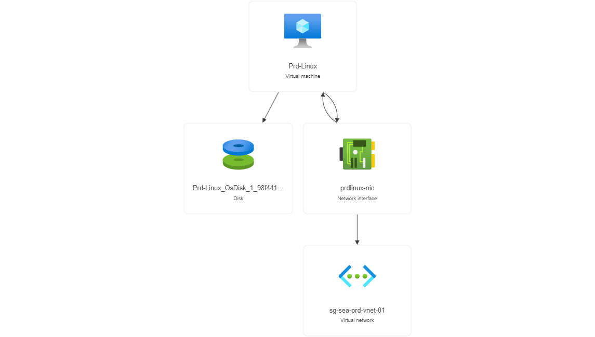
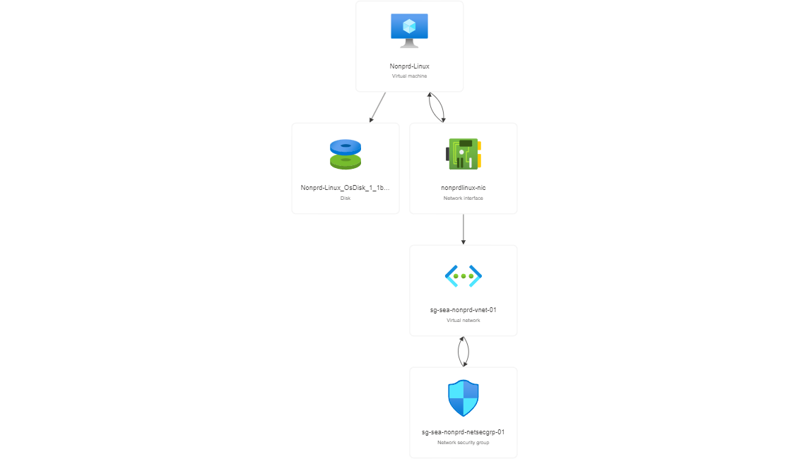

# Splitting the file up
## Overview
Instead of putting all code in a single file, we can split a single file to multiple subsidiary files. Terraform automatically loads all .tf files in the current directory during execution. For more information, you can click [here](https://jhooq.com/terraform-split-main-tf/)

## Terraform configuration files
A Terraform configuration file is used to define and manage infrastructure resources using Terraform, an open-source infrastructure as code (IaC) tool. It allows you to describe the desired state of your infrastructure in a declarative manner.
- ***.tf:** *Define a distinct *set of configuration objects*, code in the Terraform language is stored in plain text files called configuration files
- ***_override.tf:** Use override files *only in special circumstances*. Over-use of override files hurts readability
- **.terraform.lock.hcl:** Terraform *automatically creates* or updates the dependency lock file each time you *run the terraform init command*. Including version constraints, version selections and checksum (hash)
- **.tf.vars:** It is a plain text file *used to define variables* for Terraform, an infrastructure as code (IaC) tool. Containing *key-value pairs* that define values for variables used in Terraform configuration files
- **.tfstate:** Used to *map real world resources to your configuration*, keep track of metadata, and to improve performance for large infrastructures. *Do NOT modify* the terraform state file 
- **.tfstate.backup:** Every time you apply Terrafrom it writes a copy of the current state of your infrastructure to a file called terraform.tfstate if this file is already present then it will move the *old state file* to a file called terraform.tfstate.backup and will create a new terraform.tfstate file

## Terraform file executive order
- **provider.tf:** Terraform configures the providers *specified in the provider block* in the order they are listed in the file
- **terraform.tfvars:** These files are read, and they contain *variable definitions* that are *used throughout the configuration*
- ***.tf:** Terraform loads and evaluates all .tf files in *alphabetical order based on their file names*. No intrinsic meaning of main.tf. In a .tf file, blocks is called *simultaneously*
- ***_override.tf:** They’re *loaded after all non-override files in alphabetical order*, used to override resources or modules defined in the other .tf files
- **outputs.tf:** Terraform *outputs any values* specified in the output blocks in the configuration files

# File Architecture

In this method, the project will be splitted into 4 different major files: main.tf, dmgmt.tf, production.tf and nonproduction.tf. All file in this folder will be executed when running terraform apply
- **main.tf** file: Create some essential things including: resource groups, key vault, DDoS protection, governance, virtual networks and peering all of them together

- **dmgmt.tf** file: Create all resources in management group

- **production.tf** file: Create all resources in non-production group

- **nonproduction.tf** file: Create all resources in production group

## File Breakdown:
It’s common to define providers, input variables, and output values in their files. Execute the following:
- provider.tf will be executed first in *terraform init* to pull .terraform file including modules and providers information. This file will execute **around 30s**
- All variables in locals.tf and variables.tf files will be loaded into memory **in seconds**
- *.tf files will be *parallel executed* basing on depend functions in certain .tf files
- output.tf will show some necessary informations relating to resources created

## How to use this method
- Step 1: Check **locals.tf** file and edit some essential variables to adapt for your demain
- Step 2: Run **teeaform init** to pull the corresponding provider folder (*.terraform* folder)
- Step 3: Run **terraform validate** to check whether the current configuration is valid
- Step 4: Run **terraform plan -out main.tf** to create an executive plan (*main.tf* file), check the azure account, azure subscription to see the current state
- Step 5: Run **terraform apply** to create or update infrastructure. The state of the terraform deployment (ip, address, ...) will be writen into *terraform.tfstate* and *terraform.tfstate.backup* will be created automatically for backup purpose. 
- Step 6: Run **terraform destroy** to delete all resource created

## Note
- We can *ignore the provider* registration by *skip_provider_registration = "true"* in **provider.tf** file. You can replace this command to your tenant_id, subscription_id, client info, ...
- Microsoft will offer **free $200** in the first month when you create a new Azure account. A trial account will facilitate its owner a change to experience a wide range of Azure's services. However, Azure will **limit the Usage of resources**, user can check the account limit in Search Bar by typing Quotas
- All essential variables will be declared in **locals.tf** file such as: localtion, resource groups, address spaces, subnets,... You can edit all variables to adapt your requirements
- If you want to create *Gateway* and *Bastion*, you have to create **GatewaySubnet** and **AzureBastionSubnet** for specific services respectively
- The **Storage account** will be *retain 14 days* after delete by Azure policy. Therefore, you have to change Storage Account Name in *locals.tf file* at *name_of_stracc* variable to prevent the error
- **Resource Templates** were exported and saved in Azure/*.tf

## Azure diagram

## Azure resource visualizer
- sg-sea-dmgmt-rsg-01

- sg-sea-prd-rsg-01

- sg-sea-nonprd-rsg-01
