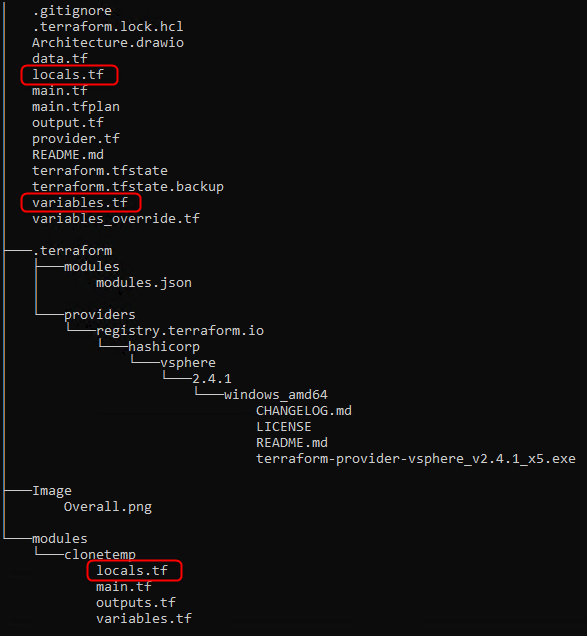
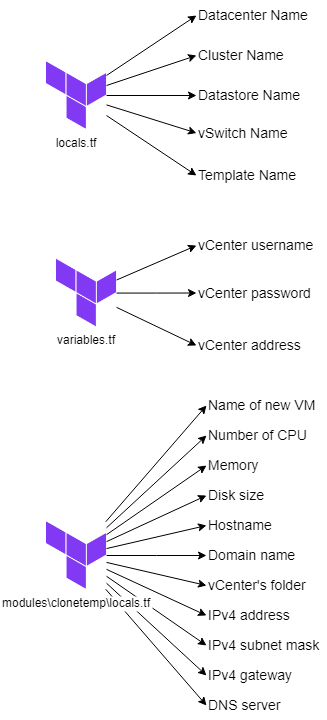

# Deploy Ubuntu in vCenter by Terraform
After this document, you can learn:
- Get familiar with deploying several VM in VMware by Terraform
- How to use Terraform's for_each and Terraform's object
- How to use Terraform's data sources

## Implementation

  

1. Deploy a sample VM
- You **can normally use ISOs** file to deploy many VMs by Terraform. However, the major disadvatange is that the VMware **can't configure** any information into this VM such as IP address, hostname, dns or etc... during the deployment
- You can setup some information relating to this VM such as username, password, disk, network, disk... In this certain document, I will **keep the login account** for the template
- The VM's disk which is cloned by the Template will have **disk capacity equal or higher** than the sample VM's disk. Therefore, keep considering about the disk when deploying the sample VM
2. Install VMware tool
- After creating a sample VM, you **have to install VMware tool** into this VM which alows VMware to modify VM information
3. Convert to Template
- Power off the sample VM
- Convert this VM into Template
4. Leverage this Template to deploy many VMs by Terraform
- Refer this [link](https://registry.terraform.io/providers/hashicorp/vsphere/latest/docs) for more information
- Take some information relating to the vCenter such as: username, password, and server address by Terraform's data function
- Change some variables in variables.tf and modules/clonetemp/locals.tf file

## How to use this code
This is the folder tree

  

You can download this code and edit dedicated information in <code>locals.tf</code>, <code>variables.tf</code> and <code>./modules/clonetemp/locals.tf</code> files

  

- <code>variables.tf</code>: This file contents sensitive information such as password and IP address
- <code>locals.tf</code>: This file includes some vCenter's information relating to the deployment VM
- <code>./modules/clonetemp/locals.tf</code>: You can configure VM's information such as IP, DNS server, hostname, CPU, memory, disk, etc.

## Bonus
1. for_each and count in Terraform
- for_each: The <code>for_each</code> meta-argument is used when you want to create multiple instances of a resource *based on elements of a map or set*. It allows you to *dynamically generate resources for each element* of the given map or set
- count: The <code>count</code> meta-argument is used when you want to create a *fixed number of resource instances*. Unlike for_each, which works with maps and sets, *count works with a numeric value that represents the exact number of instances* you want to create

2. Ubuntu DNS setup, you can read more [here](https://unix.stackexchange.com/questions/612416/why-does-etc-resolv-conf-point-at-127-0-0-53)
- Netplan is a utility used in Ubuntu (since version 17.10) and other Linux distributions that employ systemd-networkd or NetworkManager to manage network configurations. Therefore, if you want to configure Network information, you have to configure in <code>/etc/netplan/*.yaml</code>
- Netplan will split internal DNS and external DNS configuration. It will bring enormous benefits for services using internal DNS such as container technology
- Ubuntu runs <code>systemd-resolved</code> as a DNS client service. The <code>systemd-resolved</code> generates two configuration files
  - <code>/run/systemd/resolve/stub-resolv.conf</code> tells DNS client libraries to send their queries to 127.0.0.53. In Linux, 127.0.0.53 refers to the loopback address (for internal communication) used for name resolution
  - <code>/run/systemd/resolve/resolv.conf</code> tells DNS client libraries to send their queries to IP addresses to external DNS server